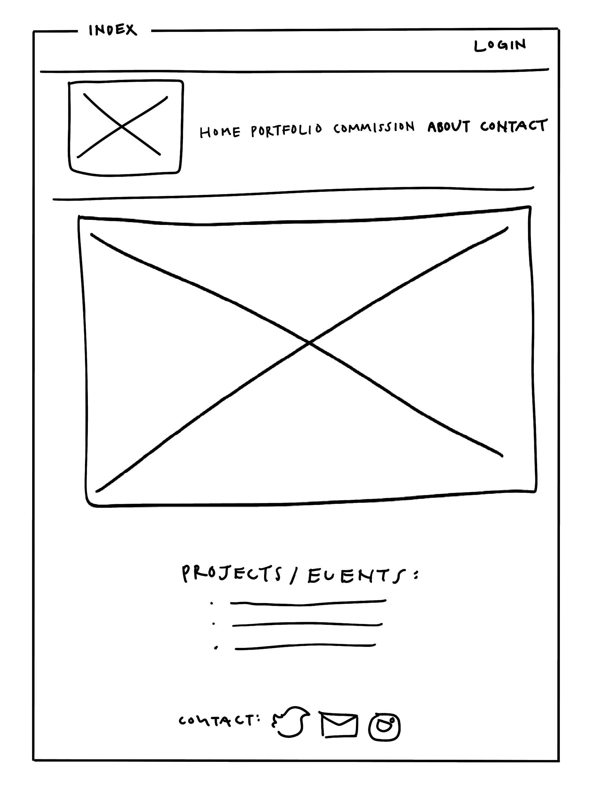
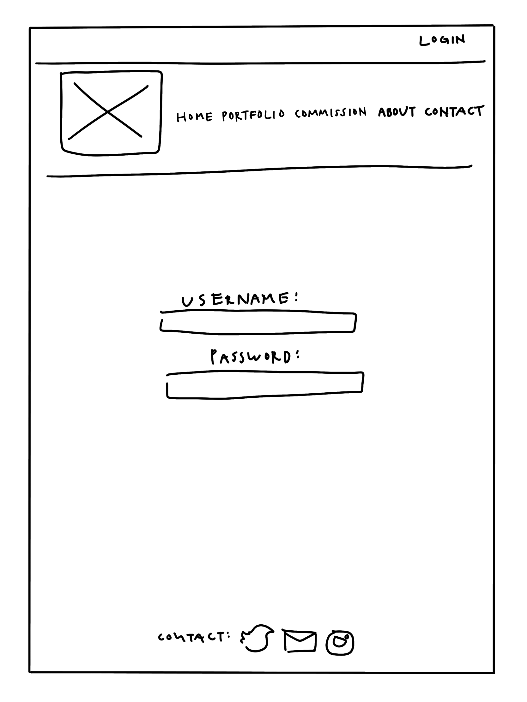
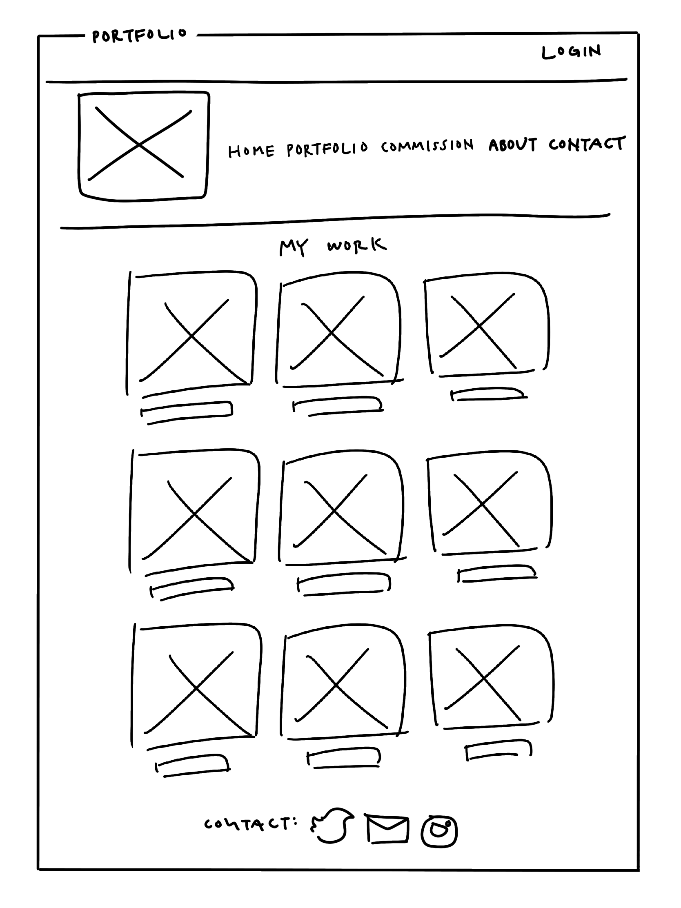
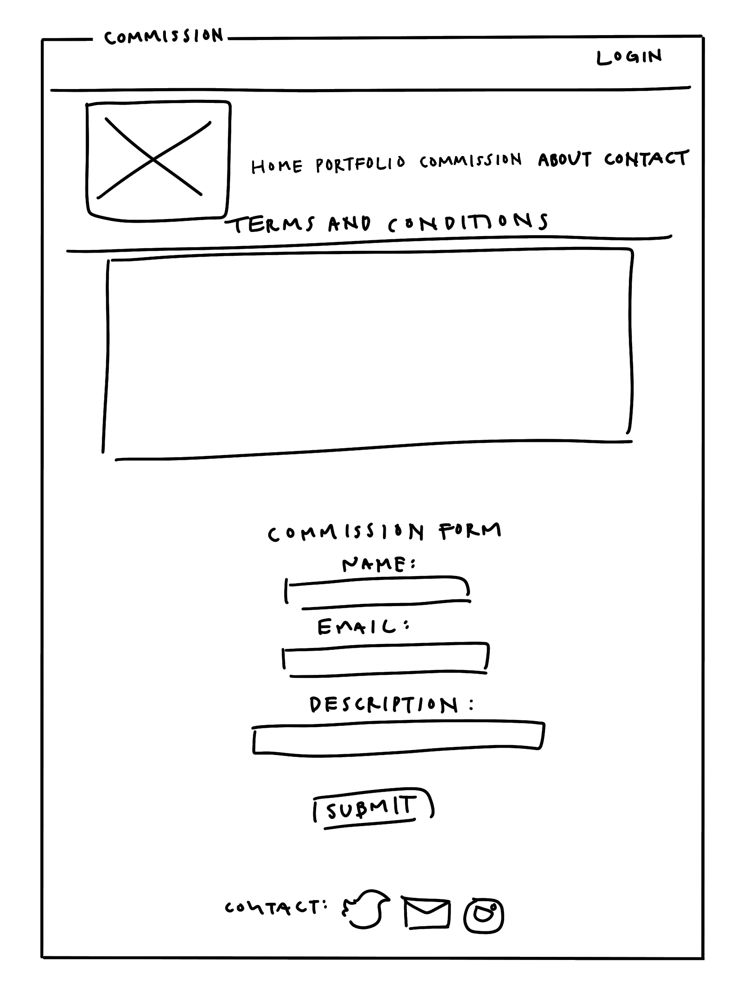
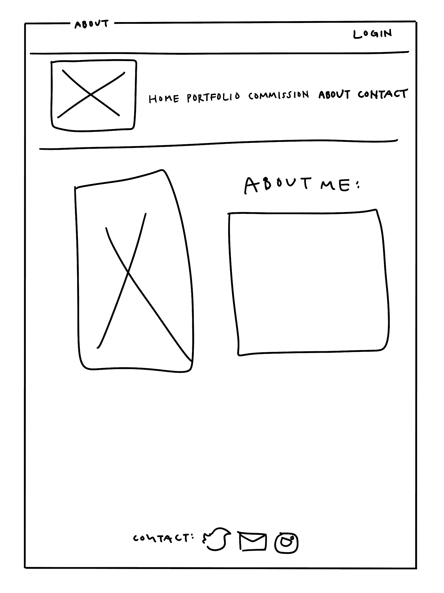
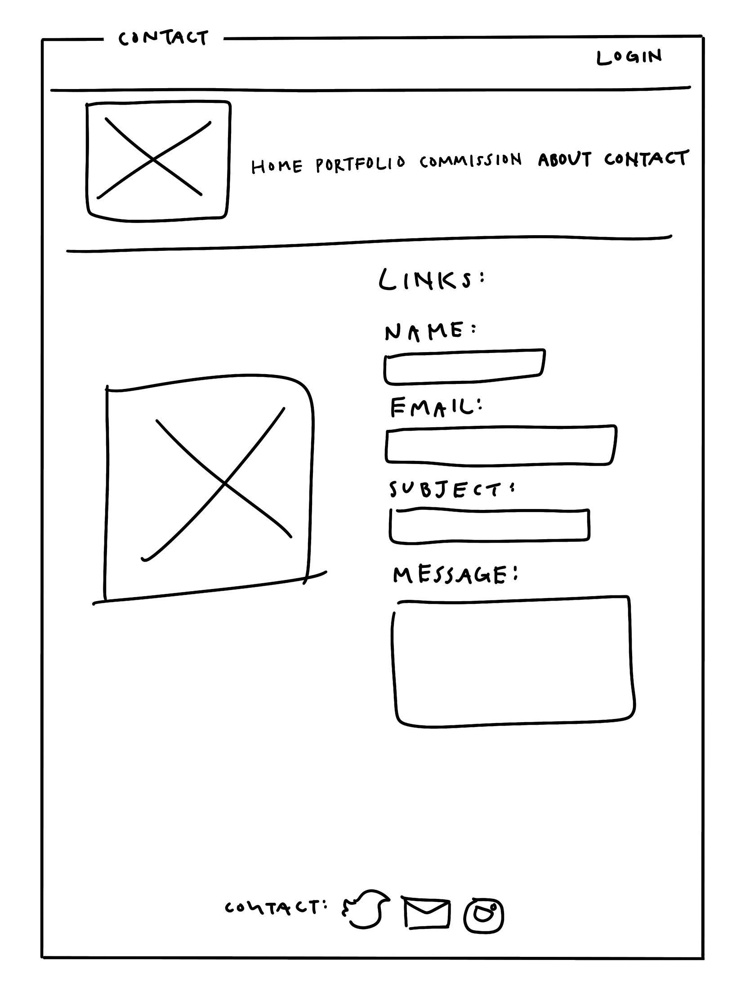
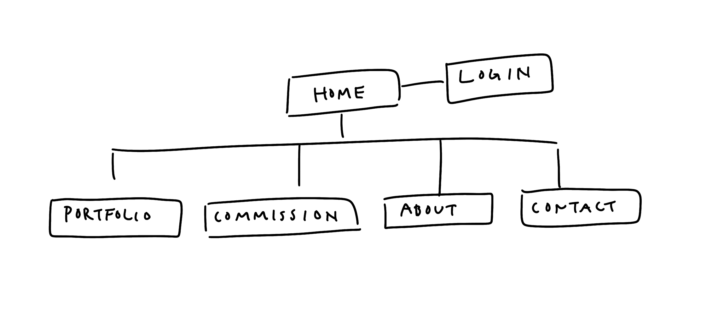

# Online Artist Portfolio

## Overview

This web application will be an online portfolio for a freelance artist to showcase their work and for potential customers to make commission inquiries and leave feedback on the artwork. Users of the site will be able to leave comments on the artwork. Comments will be monitored and can be removed if deemed inappropriate by the artist. There will also be a page on the web app with a form that will allow visitors of the site to commission and contact the artist.


## Data Model

This application will store users, comments, commissions, and messages.

* Users can comment on the artwork as well as commission and message the artist

An Example User:

```javascript
{
  username: //username,
  email: //email
  password: // a password hash
  date: //date user was created
}
```

An Example Comment:

```javascript
{
  name: //name of commenter,
  email: //email of commenter
  date: //date comment was left at
  comment: //actual comment
}
```

An Example Commission:

```javascript
{
  name: //name of commissioner,
  email: //commissioner's email
  description: //description of commission
}
```

An Example Message:

```javascript
{
  name: //name of person sending message
  email: //messenger's email
  subject: //subject line
  message: //actual message
}
```

## Wireframes

/ - home page that has a slideshow cycling through artwork



/users/login - login page for artist



/portfolio - page for showing all artwork, under each piece is a section for comments



/commission - page with a form for commissions 



/about - about page for the artist



/contact - a page with the artist's socials and a form for business inquiries 



## Site map



## User Stories or Use Cases

1. as a user, I can log in to the site
2. as a user, I can view and comment on artwork
3. as a user, I can fill out the commission and contact forms


## Annotations / References Used

1. [passport.js authentication docs](http://passportjs.org/docs) 
2. [bootstrap](https://getbootstrap.com/docs/4.0/getting-started/introduction/) 
